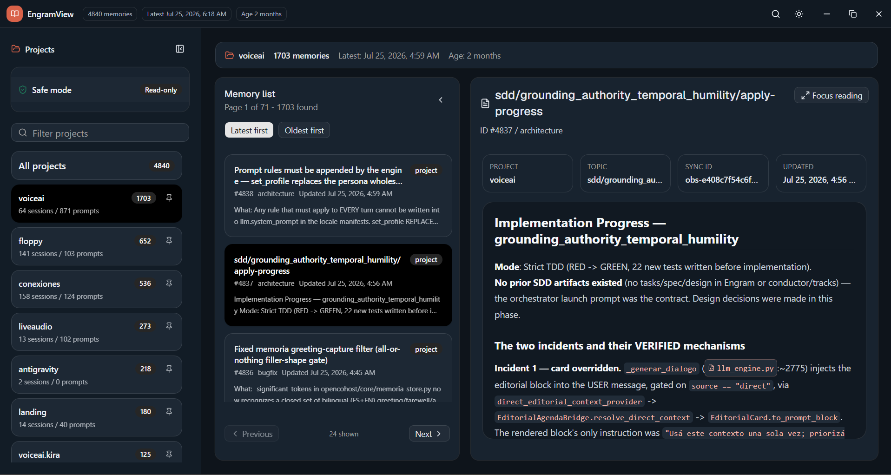
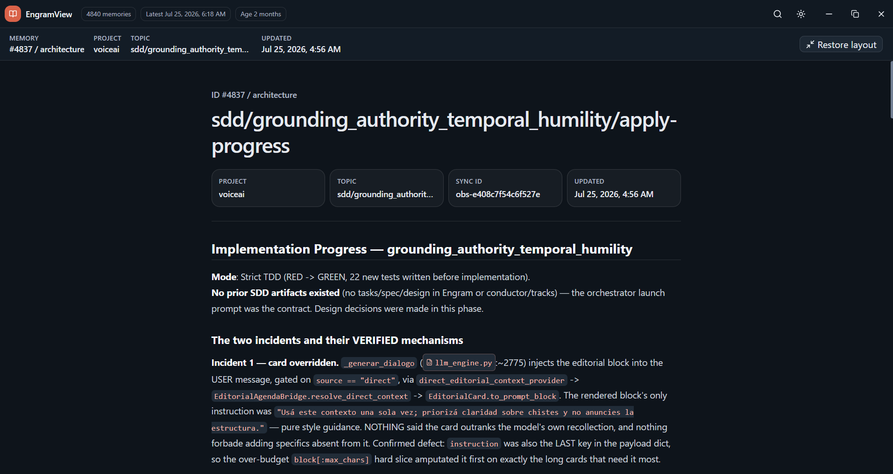

<p align="center">
  
</p>

<h1 align="center">EngramView</h1>

<p align="center">
  <strong>Unofficial read-only desktop browser for local Engram memory databases.</strong>
</p>

<p align="center">
  <a href="README.md">English</a> • <a href="README.es.md">Español</a>
</p>

---

> [!NOTE]
> **Unofficial App:** EngramView is an independent, unofficial viewer created for [Engram](https://github.com/Gentleman-Programming/engram).
> It was built out of the need to **avoid cluttering Obsidian vaults or markdown readers** with automated AI memory logs, providing a dedicated, clean UI focused entirely on project memory inspection and AI agent traceability.

EngramView is a desktop app for reading your local Engram memory database by project. It is intentionally **read-only**. It can list projects, search memories, inspect metadata, and open full memory content, but it **cannot edit, delete, import, export, or migrate** Engram data.

---

## 📸 Screenshots

<p align="center">
  
</p>

<p align="center">
  
</p>

---

## 🚀 Quick Start

```bash
# Install dependencies
pnpm install

# Run in development mode
pnpm tauri dev
```

---

## 📁 Custom Engram Memory Location (`ENGRAM_DATA_DIR`)

By default, EngramView looks for the database at:
- **Windows:** `%USERPROFILE%\.engram\engram.db` *(e.g. `C:\Users\your_user\.engram\engram.db`)*
- **macOS / Linux:** `~/.engram/engram.db`

### What if your Engram memories are in a custom path?
If your `.engram` data directory is stored on another drive, a custom folder, or a sync directory, set the `ENGRAM_DATA_DIR` environment variable to point to the **directory** containing `engram.db`.

#### 1. Windows PowerShell (Development)
```powershell
$env:ENGRAM_DATA_DIR="D:\CustomPath\.engram"
pnpm tauri dev
```

#### 2. Windows CMD (Development)
```cmd
set ENGRAM_DATA_DIR=D:\CustomPath\.engram
pnpm tauri dev
```

#### 3. macOS / Linux (Bash or Zsh)
```bash
export ENGRAM_DATA_DIR="/custom/path/to/.engram"
pnpm tauri dev
```

#### 4. Setting it Permanently in Windows System Environment Variables
If you run the standalone `engramview.exe` executable:
1. Press `Win + R`, type `sysdm.cpl` and press **Enter**.
2. Go to the **Advanced** tab and click **Environment Variables**.
3. Under **User variables**, click **New...**.
4. Variable name: `ENGRAM_DATA_DIR`
5. Variable value: `D:\CustomPath\.engram` *(path to directory containing `engram.db`)*
6. Click **OK** and launch `engramview.exe`.

Or via PowerShell (User Scope):
```powershell
[System.Environment]::SetEnvironmentVariable("ENGRAM_DATA_DIR", "D:\CustomPath\.engram", "User")
```

---

## ✨ Features & Capabilities

| Area | Behavior |
| --- | --- |
| **Projects** | Lists Engram projects with observation, session, prompt, latest-memory, and first-memory metadata. |
| **Memories** | Shows paginated memory cards with ID, title, type, scope, preview, timestamps, and topic key. |
| **Search** | Searches the selected project using Engram's FTS index when available. |
| **Sorting** | Switches the memory list between latest-first and oldest-first. |
| **Detail** | Opens the full memory content with sync ID, topic key, project, and timestamps. |
| **Safety status** | Displays whether the app is connected to the expected local Engram database. |

---

## 🔒 Safety Model

EngramView is designed strictly as a viewer, not an admin console:

- Opens SQLite with `SQLITE_OPEN_READ_ONLY` flags.
- Enables `PRAGMA query_only` for an extra SQLite-level write guard.
- Exposes only read-oriented Rust/Tauri commands (`project list`, `memory list`, `memory detail`, `database info`).
- Does **not** expose update, delete, sync, import, export, migration, or shell execution commands.
- Does **not** run an external web server.

---

## 🛠️ Tech Stack

| Layer | Technology |
| --- | --- |
| **Desktop Shell** | Tauri 2 |
| **Frontend** | React 19 + TypeScript + Vite |
| **Styling** | Tailwind CSS 4 + Radix Primitives |
| **Backend** | Rust |
| **Database Access** | `rusqlite` with bundled SQLite (Read-Only) |

---

## 🐛 Feedback & Suggestions

If you have a suggestion, feature request, or found a bug, please open an issue on **[GitHub Issues](https://github.com/FranGuh/EngramView/issues)**.

---

## 📜 License

This project is licensed under the [MIT License](LICENSE).